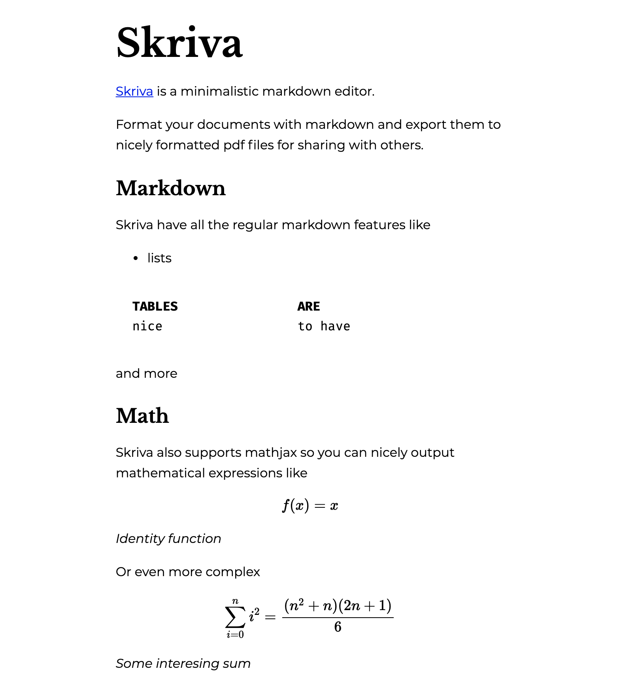

# Skriva

Minimalistic markdown editor.

## Example
```
# Skriva 

[Skriva](https://github.com/fippli/skriva) is a minimalistic markdown editor.

Format your documents with markdown and export them to nicely formatted pdf files for sharing with others.

## Markdown
Skriva have all the regular markdown features like
- lists

| tables | are     |
| :----- | :------ |
| nice   | to have |

and more

## Math
Skriva also supports mathjax so you can nicely output mathematical expressions like

$$ f(x) = x $$
*Identity function*

Or even more complex

$$\sum_{i=0}^n i^2 = \frac{(n^2+n)(2n+1)}{6}$$

*Some interesing sum*
```# Skriva 

[Skriva](https://github.com/fippli/skriva) is a minimalistic markdown editor.

Format your documents with markdown and export them to nicely formatted pdf files for sharing with others.

## Markdown
Skriva have all the regular markdown features like
- lists

| tables | are     |
| :----- | :------ |
| nice   | to have |

and more

## Math
Skriva also supports mathjax so you can nicely output mathematical expressions like

$$ f(x) = x $$
*Identity function*

Or even more complex

$$\sum_{i=0}^n i^2 = \frac{(n^2+n)(2n+1)}{6}$$

*Some interesing sum*


outputs



## Contributions are welcome
Put an issue or open a pr
